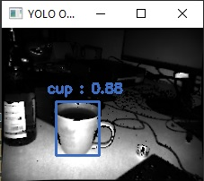

# Tutorial - Object Detection with YOLO
This example shows how to detect objects in an image using Royale's Python wrapper and the pre-trained [YOLO network](https://pjreddie.com/media/files/papers/YOLOv3.pdf).
The YOLO related code was inspired by [this](https://github.com/arunponnusamy/object-detection-opencv/blob/master/yolo_opencv.py).

## How to install
For this example you will need the Royale Python Wrapper and Python. In the README in the Python folder of your Royale package (C:\Program Files\royale\5.10.0.2751\python\README.md) you can see which python version is supported on your system. 

To use the Python wrapper you need to set the variable `ROYALE_DIR` (line 31 in sample_yolo.py) 
to the Python folder inside your Royale installation. 

This sample requires a few additional Python libraries: OpenCV, Numpy, Matplotlib.
You can easily install them via pip.

Finally you need to download the YOLO [weights](https://pjreddie.com/media/files/yolov3-tiny.weights), [config](https://github.com/pjreddie/darknet/blob/master/cfg/yolov3-tiny.cfg)
and [classes](https://github.com/arunponnusamy/object-detection-opencv/blob/master/yolov3.txt) (rename the file to yoloclasses.txt) and put them in the same directory as this code.
We use the third version of tiny YOLO, but it should be possible to use other versions of YOLO, too, if
you have the corresponding weights, config and classes. 

## Code explanation

First we **set the available arguments** and then we **open the camera**. You can either use an usb-connected
camera or an rff-file. 

```py
    # Set the available arguments
    platformhelper = PlatformHelper()
    parser = argparse.ArgumentParser (usage = __doc__)
    add_camera_opener_options (parser)
    options = parser.parse_args()
   
    opener = CameraOpener (options, min_access_level=1)

    try:
        cam = opener.open_camera ()
    except:
        print("could not open Camera Interface")
        sys.exit(1)

    try:
        # retrieve the interface that is available for recordings
        replay = cam.asReplay()
        print ("Using a recording")
        print ("Framecount : ", replay.frameCount())
        print ("File version : ", replay.getFileVersion())
    except SystemError:
        print ("Using a live camera")
```

Next we **initialize a queue and a data listener**, which we need to capture data from the camera. 
While capturing, we process an event queue.

```py
    q = queue.Queue()
    l = MyListener(q)
    cam.registerDataListener(l)
    cam.startCapture()
	
    lensP = cam.getLensParameters()
    l.setLensParameters(lensP)

    process_event_queue (q, l)

    cam.stopCapture()
    print("Done")
```

#### Setting the lens parameters
As you can see above, we take the lens parameters of the camera and set them in the listener.
We do so by using the function below. This function constructs the camera matrix and the
distortion coefficients from the camera parameters.  

```py
    def setLensParameters(self, lensParameters):
        # Construct the camera matrix
        # (fx   0    cx)
        # (0    fy   cy)
        # (0    0    1 )
        self.cameraMatrix = np.zeros((3,3),np.float32)
        self.cameraMatrix[0,0] = lensParameters['fx']
        self.cameraMatrix[0,2] = lensParameters['cx']
        self.cameraMatrix[1,1] = lensParameters['fy']
        self.cameraMatrix[1,2] = lensParameters['cy']
        self.cameraMatrix[2,2] = 1

        # Construct the distortion coefficients
        # k1 k2 p1 p2 k3
        self.distortionCoefficients = np.zeros((1,5),np.float32)
        self.distortionCoefficients[0,0] = lensParameters['k1']
        self.distortionCoefficients[0,1] = lensParameters['k2']
        self.distortionCoefficients[0,2] = lensParameters['p1']
        self.distortionCoefficients[0,3] = lensParameters['p2']
        self.distortionCoefficients[0,4] = lensParameters['k3']
```

### data listener
The `MyListener` class contains a function to **handle new data** and a function to **display this data** as images.
New data is added to a queue that is then [processed](#processing-the-event-queue). 

```py
    def onNewData(self, data):
        p = data.npoints()
        self.queue.put(p)
```

The images are created from the data that is captured by the camera. We **create one image** that containes the gray values. 
It is possible to toogle the undistortion of the image by pressing `d`.

```py
    def paint (self, data):
        """Called in the main thread, with data containing one of the items that was added to the
        queue in onNewData.
        """
        # mutex to lock out changes to the distortion while drawing
        self.lock.acquire()

        depth = data[:, :, 2]
        gray = data[:, :, 3]
        confidence = data[:, :, 4]

        zImage = np.zeros(depth.shape, np.float32)
        grayImage = np.zeros(depth.shape, np.float32)

        # iterate over matrix, set zImage values to z values of data
        # also set grayImage adjusted gray values
        xVal = 0
        yVal = 0
        for x in zImage:        
            for y in x:
                if confidence[xVal][yVal]> 0:
                  grayImage[xVal,yVal] = self.adjustGrayValue(gray[xVal][yVal])
                yVal=yVal+1
            yVal = 0
            xVal = xVal+1

        grayImage8 = np.uint8(grayImage)

        # apply undistortion
        if self.undistortImage: 
            grayImage8 = cv2.undistort(grayImage8,self.cameraMatrix,self.distortionCoefficients)
```

The **object detection** happens in the next step. To do this we call [detectObjects](#object-detection-with-yolo) on our grey image. The image
needs to be converted to rgb first, because YOLO expects three channels as input.
After this we **display the image**. 

```py
        # convert the image to rgb first, because YOLO needs 3 channels, and then detect the objects
        yoloResultImageGray = detectObjects(cv2.cvtColor(grayImage8, cv2.COLOR_GRAY2RGB))

        # finally show the images
        cv2.imshow("YOLO Objects on Gray Image", yoloResultImageGray)
```

## Processing the event queue 
This function takes a data element from the queue, that the [data listener](#data-listener) creates, and
gives it to the paint function of the [listener](#data-listener) to display it. 
The processing goes on as long as there are some elements on the queue and `esc` is not pressed.

```py
def process_event_queue (q, painter):
    while True:
        try:    
            # try to retrieve an item from the queue.
            # this will block until an item can be retrieved
            # or the timeout of 1 second is hit
            if len(q.queue) == 0:
                item = q.get(True, 1)
            else:
                for i in range (0, len (q.queue)):
                    item = q.get(True, 1)
        except queue.Empty:
            # this will be thrown when the timeout is hit
            break
        else:
            painter.paint(item)
            # waitKey is required to use imshow, we wait for 1 millisecond
            currentKey = cv2.waitKey(1)
            if currentKey == ord('d'):
                painter.toggleUndistort()
            # close if escape key pressed
            if currentKey == 27: 
                break
```
## Object detection with YOLO
To **detect objects with the YOLO network**, we use the function below. 
The possible classes, a color lookup table and the **YOLO network** are defined globally.

```py
CLASSES = None
with open("yoloclasses.txt", 'r') as f:
    CLASSES = [line.strip() for line in f.readlines()]
COLORS = np.random.uniform(0, 255, size=(len(CLASSES), 3))

net = cv2.dnn.readNet("yolov3-tiny.weights", "yolov3-tiny.cfg")
```

After setting some parameters, we iterate over the outputs of the YOLO net and their detections. If we
are more than 10% sure that there is an object, we save its class, the confidence value and the coordinates of its 
bounding box. 
Finally, for each object we **[draw](#drawing-the-predictions) a bounding box** and **print the class** to which it belongs **and the confidence** we have
that it actually belongs to this class on the image. 

```py
def detectObjects(img):
    Width = img.shape[1]
    Height = img.shape[0]
    scale = 1/255

    blob = cv2.dnn.blobFromImage(img, scale, (416,416), (0,0,0), False, crop=False)
    net.setInput(blob)
    outs = net.forward(get_output_layers(net))

    class_ids = []
    confidences = []
    boxes = []
    conf_threshold = 0.01
    nms_threshold = 0.5

    for out in outs:
        for detection in out:
            scores = detection[5:]
            class_id = np.argmax(scores)
            confidence = scores[class_id]
            if confidence > 0.1:
                center_x = int(detection[0] * Width)
                center_y = int(detection[1] * Height)
                w = int(detection[2] * Width)
                h = int(detection[3] * Height)
                x = center_x - w / 2
                y = center_y - h / 2
                class_ids.append(class_id)
                confidences.append(float(confidence))
                boxes.append([x, y, w, h])

    indices = cv2.dnn.NMSBoxes(boxes, confidences, conf_threshold, nms_threshold)
    for i in indices:
        box = boxes[i]
        x = box[0]
        y = box[1]
        w = box[2]
        h = box[3]
        draw_prediction(img, class_ids[i], confidences[i], round(x), round(y), round(x+w), round(y+h))
        
    return img
```

##### drawing the predictions

The drawing of the predictions consists of a few steps. First we create a string that contains
the label of the objects and the confidence value. Then we determine the color of the object 
with the help of a look up table. Next we draw the bounding box in the correct color around the object. And finally
we print the string we created in the same color on the image. 

```py
def draw_prediction(img, class_id, confidence, x, y, x_plus_w, y_plus_h):
    label = str(CLASSES[class_id]) + " : " + "{:.2f}".format(confidence)
    color = COLORS[class_id]
    cv2.rectangle(img, (x,y), (x_plus_w,y_plus_h), color, 2)
    cv2.putText(img, label, (x-10,y-10), cv2.FONT_HERSHEY_SIMPLEX, 0.5, color, 2)
```
This will give you output similar to this : 
