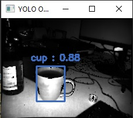

# Tutorial - Object Detection with YOLO
This example shows how to detect objects in an image using Royale's Python wrapper and the pre-trained [YOLO network](https://pjreddie.com/media/files/papers/YOLOv3.pdf).
The YOLO related code was inspired by [this](https://github.com/arunponnusamy/object-detection-opencv/blob/master/yolo_opencv.py).

## How to install
For this example you will need the Royale Python Wrapper (Royale 5.XX to use the convenience layer) and Python (Version 3.10). To use the Python wrapper you need to set the variable `ROYALE_DIR` (line 31 in sample_yolo.py) 
to the Python folder inside your Royale installation. 

This sample requires a few additional Python libraries: OpenCV, Numpy, Matplotlib.
You can easily install them via pip.

Finally you need to download the YOLO [weights](https://pjreddie.com/media/files/yolov3-tiny.weights), [config](https://github.com/pjreddie/darknet/blob/master/cfg/yolov3-tiny.cfg)
and [classes](https://github.com/arunponnusamy/object-detection-opencv/blob/master/yolov3.txt) (rename the file to yoloclasses.txt) and put them in the same directory as this code.
We use the third version of tiny YOLO, but it should be possible to use other versions of YOLO, too, if
you have the corresponding weights, config and classes. 

## Code explanation
By using our new convenience layer you can use Royale in a way, that you probably know from using OpenCV. 

First a `RoyaleCapture` object is created. Then we enter a `while`-loop that runs as long as we run the camera. You end the loop by pressing the `esc` key. 

Inside this loop we get the gray and depth images from the capture objects `record_data` function. 
On these images we then can apply the object detection. How this works is explained [below](#object-detection-with-yolo).

After the loop we end the recording through the `end_recording` function. 

```py 
def main ():
    cap = RoyaleCapture()
    while True:
        grayImg, depthImg = cap.record_data()

        # convert the image to rgb first, because YOLO needs 3 channels, and then detect the objects
        yoloResultImageGray = detectObjects(cv2.cvtColor(grayImg, cv2.COLOR_GRAY2RGB))

        cv2.imshow("YOLO Object Detection", yoloResultImageGray)

        currentKey = cv2.waitKey(1)
        # close if escape key pressed
        if currentKey == 27: 
            break
    cap.end_recording()
    print("Done")
```

## Object detection with YOLO
To **detect objects with the YOLO network**, we use the function below. 
The possible classes, a color lookup table and the **YOLO network** are defined globally.

```py
CLASSES = None
with open("yoloclasses.txt", 'r') as f:
    CLASSES = [line.strip() for line in f.readlines()]
COLORS = np.random.uniform(0, 255, size=(len(CLASSES), 3))

net = cv2.dnn.readNet("yolov3-tiny.weights", "yolov3-tiny.cfg")
```

After setting some parameters, we iterate over the outputs of the YOLO net and their detections. If we
are more than 10% sure that there is an object, we save its class, the confidence value and the coordinates of its 
bounding box. 
Finally, for each object we **[draw](#drawing-the-predictions) a bounding box** and **print the class** to which it belongs **and the confidence** we have
that it actually belongs to this class on the image. 

```py
def detectObjects(img):
    Width = img.shape[1]
    Height = img.shape[0]
    scale = 1/255

    blob = cv2.dnn.blobFromImage(img, scale, (416,416), (0,0,0), False, crop=False)
    net.setInput(blob)
    outs = net.forward(get_output_layers(net))

    class_ids = []
    confidences = []
    boxes = []
    conf_threshold = 0.01
    nms_threshold = 0.5

    for out in outs:
        for detection in out:
            scores = detection[5:]
            class_id = np.argmax(scores)
            confidence = scores[class_id]
            if confidence > 0.1:
                center_x = int(detection[0] * Width)
                center_y = int(detection[1] * Height)
                w = int(detection[2] * Width)
                h = int(detection[3] * Height)
                x = center_x - w / 2
                y = center_y - h / 2
                class_ids.append(class_id)
                confidences.append(float(confidence))
                boxes.append([x, y, w, h])

    indices = cv2.dnn.NMSBoxes(boxes, confidences, conf_threshold, nms_threshold)
    for i in indices:
        box = boxes[i]
        x = box[0]
        y = box[1]
        w = box[2]
        h = box[3]
        draw_prediction(img, class_ids[i], confidences[i], round(x), round(y), round(x+w), round(y+h))
        
    return img
```

### drawing the predictions

The drawing of the predictions consists of a few steps. First we create a string that contains
the label of the objects and the confidence value. Then we determine the color of the object 
with the help of a look up table. Next we draw the bounding box in the correct color around the object. And finally
we print the string we created in the same color on the image. 

```py
def draw_prediction(img, class_id, confidence, x, y, x_plus_w, y_plus_h):
    label = str(CLASSES[class_id]) + " : " + "{:.2f}".format(confidence)
    color = COLORS[class_id]
    cv2.rectangle(img, (x,y), (x_plus_w,y_plus_h), color, 2)
    cv2.putText(img, label, (x-10,y-10), cv2.FONT_HERSHEY_SIMPLEX, 0.5, color, 2)
```
This will give you output similar to this : 
